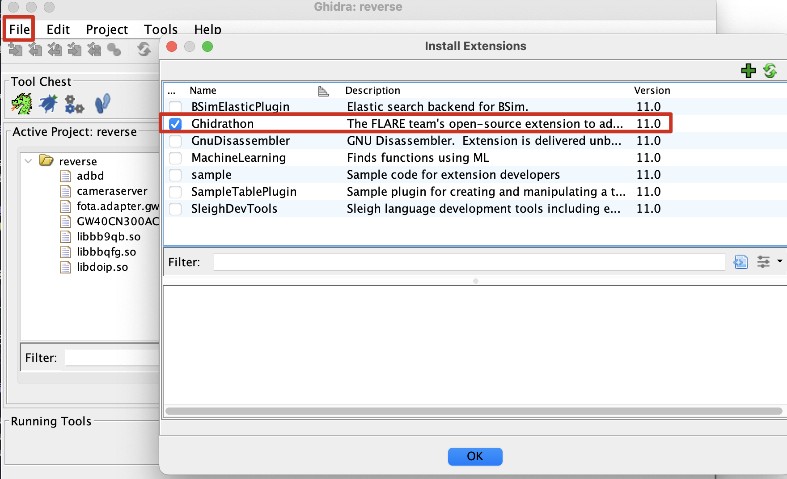
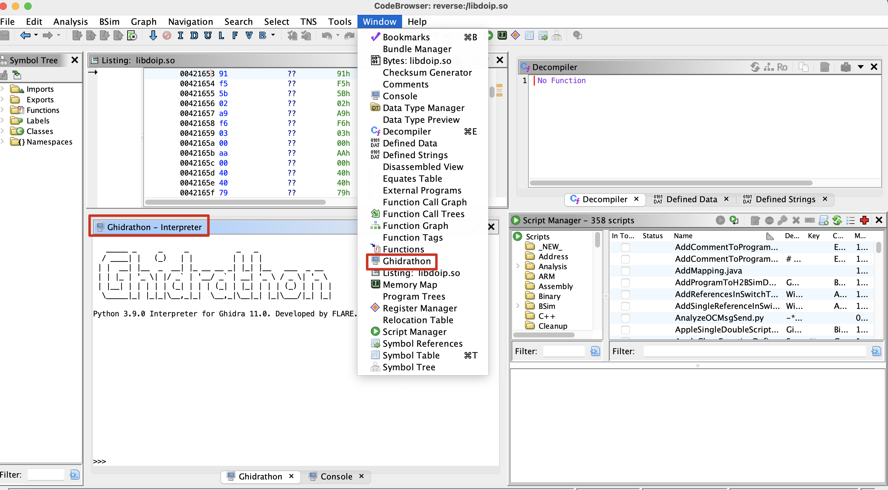

# ghidra-re

> Ghidra Reverse
> Ghidra Version: V11.0
>

由于Ghidra默认的Jpython版本仅支持python2，当前的所有脚本全部基于[Ghidrathon](https://github.com/mandiant/Ghidrathon)进行重构，并使用一键自动化安装脚本安装[Ghidra](https://github.com/NationalSecurityAgency/ghidra)、[Ghidrathon](https://github.com/mandiant/Ghidrathon)、当前所有脚本。

## 0x00.环境依赖

MAC环境依赖:
- zsh
- brew
- java 17

## 0x01.目录结构

- plugins-py:基于python的Ghidra插件
- pluhind-java:基于java的Ghidra插件

## 0x02.使用方法
> 目前仅MAC下可自动化安装
> 

step1:直接运行`install`目录下的安装脚本自动化进行安装
- 默认安装`Ghidra_11.0`、`Ghidrathon`、`plugins-py`、`plugins-java`

step2:运行`ghidra`程序启用`Ghidrathon`插件并重新启动`ghidra`

## 0x03.插件

- [x] plugins-py/GetOffsetAddr.py:获取鼠标所在位置的相对偏移地址
- [x] plugins-py/ArmRopDouble.py:ARM Rop
- [x] plugins-py/ArmRopFind.py:ARM Rop链查找

## 0x04.感谢

- [PAGalaxyLab's ghidra_scripts](https://github.com/PAGalaxyLab/ghidra_scripts)
- [grayhatacademy's ghidra_scripts](https://github.com/grayhatacademy/ghidra_scripts)