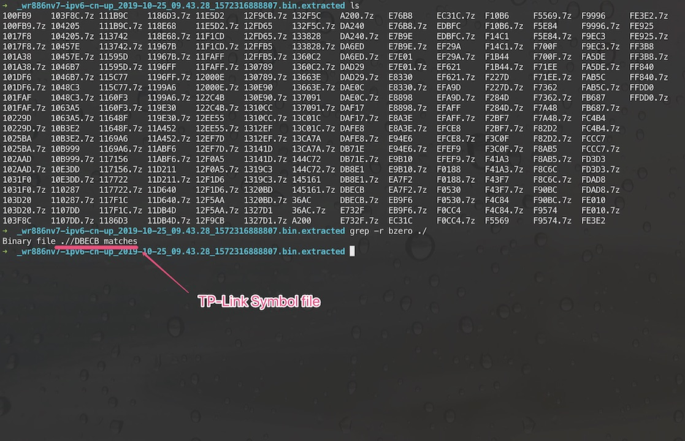
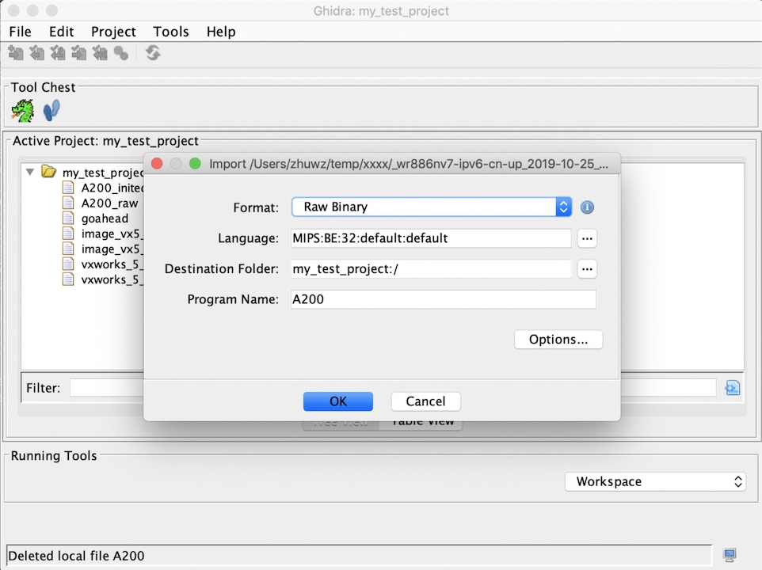
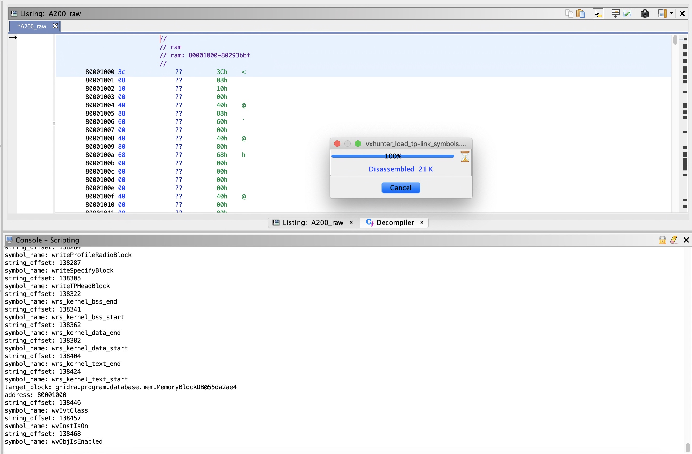

# 使用样例脚本wr886nv7_rename_function_with_error_print.py的详细步骤

## 步骤一: 下载wr886nv7固件并提取VxWorks镜像
样例wr886nv7固件[下载地址](http://download.tplinkcloud.com.cn/firmware/wr886nv7-ipv6-cn-up_2019-10-25_09.43.28_1572316888807.bin)。

使用binwalk来提取固件.

寻找TP-Link外部符号表.

在Ghidra中使用MIPS Big endian处理器及默认加载地址0来导入VxWorks固件"A200"。

先不要对VxWorks镜像进行分析，因为我们此时并不知道正确的加载地址。

## 步骤二: 执行VxHunter load tp-link symbols脚本

PS: 需要先安装VxHunter, [VxHunter项目地址](https://github.com/PAGalaxyLab/vxhunter)

在Ghidra脚本管理器中运行vxhunter_load_tp-link_symbols.py后选择TP-Link外部符号文件"DBECB"。

这个脚本会自动加载TP-Link外部符号文件, 将VxWorks镜像rebase到正确的加载地址并利用符号表修复函数名字。

## step 3: Run wr886nv7_rename_function_with_error_print.py

所有前置工作都完成了，现在可以运行wr886nv7_rename_function_with_error_print.py脚本了.

这个脚本将会分析函数的错误输出并利用这些输出对未识别的函数进行重命名.

